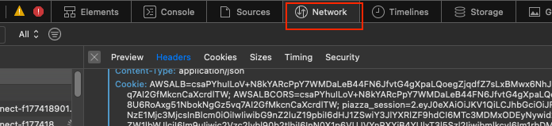
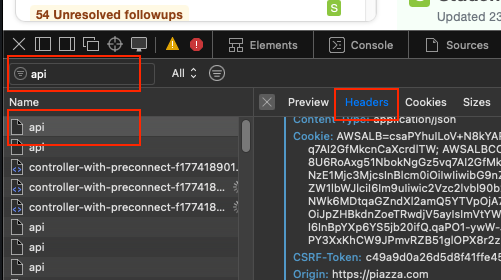
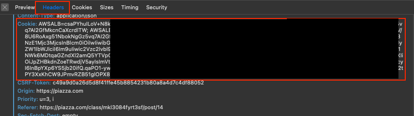
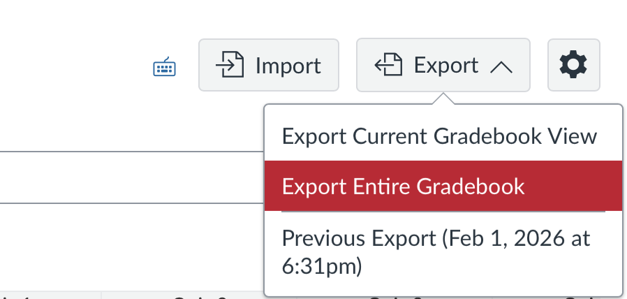
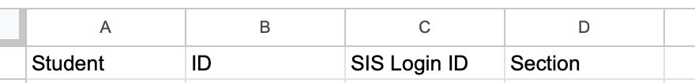
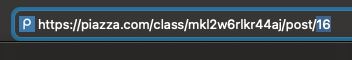
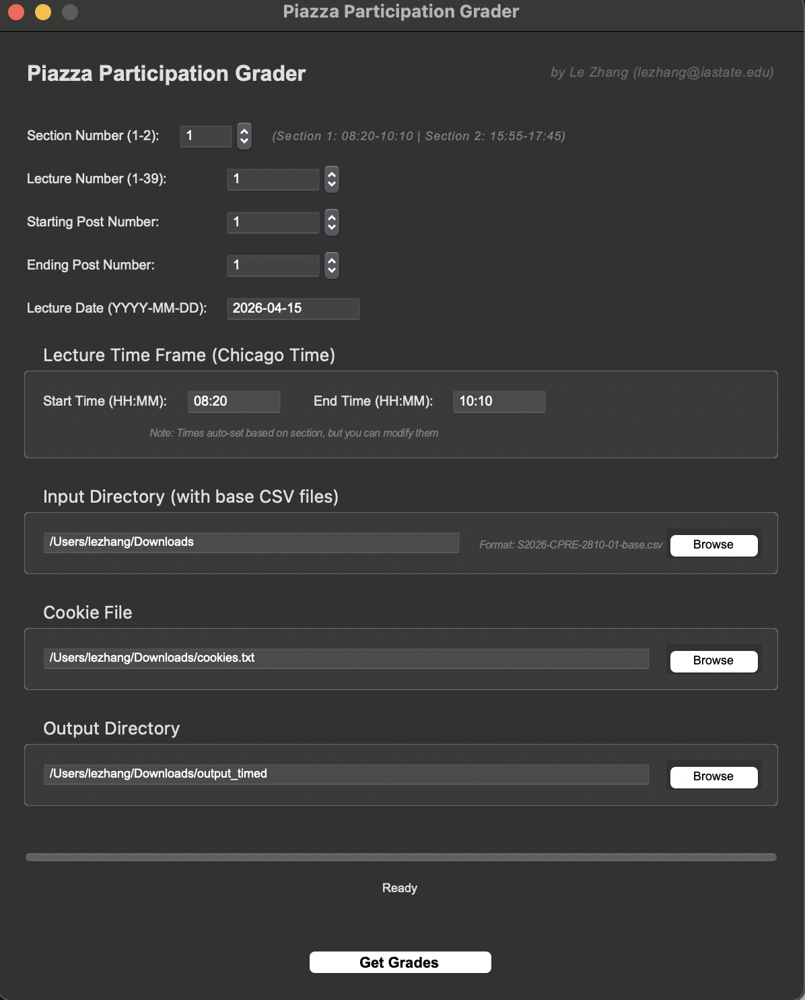

# Piazza Participation Grader V2.0 — *by Le Zhang*

Instead of extracting data using live HTML, this version gets data directly from official Piazza APIs. It matches the students by their ISU netids instead of names, which is more efficient and effective.

## Get Browser Cookies

**Requirements:**
- A modern web browser (Safari, Chrome, Firefox...)

**Steps:**

- Open your browser, login to your Piazza account.
- Right click `Inspect Elements` or press `F12` for the DevTools window, then select `Network` tab.

  

- Click any lecture questions on the webpage.
- At the top left corner of DevTools, search for `api`, then select any element named `api`:

  

- On the right hand side select `Headers` tab, then copy the entire `Cookie` section:

  

- Paste your cookies into a text file in the same directory of your script, rename the file `cookies.txt`.
- In most cases, your cookies can be valid for a few weeks, you don't need to repeat this step every time you run the script.

---

## Get Grade Book CSV from Canvas

- Open Canvas webpage, click `Grades` → `Export` → `Export Entire Gradebook`. Wait until the file download finishes.

  

- Open the downloaded gradebook with MS Excel or Google Sheets, keep only the first 4 columns: **Student, ID, SIS Login ID, and Section**. Delete all other columns. Save it as a new CSV file.

  

- (Optional) Rename the saved CSV file with the following format: `S2026-CPRE-2810-0X-base.csv`, `X` stands for the section number.

---

## Get Piazza Post IDs

- Open Piazza webpage, click the target question you'd like to grade.
- At the URL bar, locate the post ID for this question. In this case, the post ID is `16`:

  

- If a lecture has more than one questions, we only need to get the IDs for the first and the last questions of that lecture. For example, if Lecture 05 has 3 questions, we only need to get the ID for Lec05-Q1 and Lec05-Q3, since the numbers in between are continuous.

---

## Run Script

**Requirements:**
- Python 3.9 or above
- Required packages: **requests**, **pandas**, and **pytz**
- To install all required packages:

  ```
  pip install -r requirements.txt
  ```

**Steps:**

- Run the program:

  ```
  python PGrader.py
  ```

- You should see the main interface of the program:

  

- Select desired Section Number, Lecture Number, Beginning and ending Post IDs, Lecture Date, and Lecture start and end time.
- Select the corresponding CSV file created in section [Get Grade Book CSV from Canvas](#get-grade-book-csv-from-canvas). `S2026-CPRE-2810-0X-base.csv` by default if not specified.
- Select the cookies file where your browser cookies are saved. `cookies.txt` by default if not specified.
- Select the output directory. `output` by default.
- Click `Get Grades` to run the program. You will see the generated CSV file in your output directory with the grades for the selected lecture.
- Upload the output CSV directly to Canvas, the participation grades for this lecture is done.

---

## Attention

- The Piazza ID number for same question can be different for different sections. For instance, ID for Lec05-Q3 in Section 1 is `18` but ID for the same question in Section 2 is `15`. Because the poster stuffed too many redundant questions in Section 1. So always check the post IDs before running the program.
- When there are unmatched students, it might because they have posted in the wrong section. So you can always find them in the grade book of the other section.

---

## License

This program is released under the MIT License.
